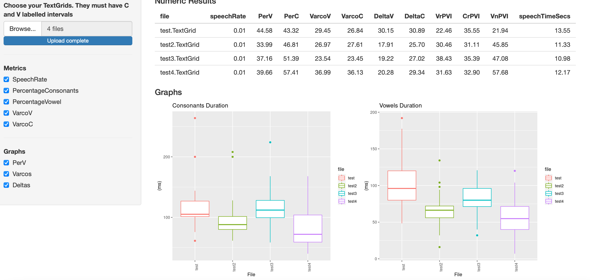

# Rythm Analysis
 A little shiny app for rhythm metrics computing and display
 
You can access the app at: [[https://wendyelvira.shinyapps.io/ritmo/](https://wendyelvira.shinyapps.io/rhythm_analysis/)](https://wendyelvira.shinyapps.io/rhythm_analysis/). Beware that is a shinyapp server, if you do not trust shiny to host your files (or they have personal information, are private...), do not upload them. Download this code instead and run it from your computer using RStudio and the shiny package (or use it in a server owned by your university).
 
 ## Input
 At least two TextGrids (or a set of them) with intervals for consonants and vowels. UTF-16 encoded preferred. You can have your by-sound transcription in any tier, you just need to specify which one.

 At this point you can have different types of transcription:
 - Orthographic
 - Phonetic
 - PTK / a 
 - C / V
 
## Output
Numeric values in graphic table  (speech rate -sounds/second., %V, %C, Varco V, Varco C, DeltaV, DeltaC) and graphs.
You can also download the duration database that will be created and the rhythm metrics in a csv file.

